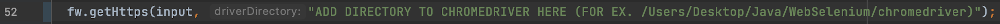

# Programming Test

Three different entry exam projects programmed in Java.  
* Problem 1 - program to find out if two Strings are anagrams to each other.
* Problem 2 - finding all web-links on a website with Selenium WebDriver.
* Problem 3 - a calculator in three different levels. 
- Level 1 accepts 2 operator and two numerical operators.
- Level 2 calculates multiple operators of the same precedence.
- Level 3 calculates multiple operators of different precedence.

All projects runs through the console.

---
## Tech/framework used

* [Maven](http://maven.apache.org)
* [JUnit4](https://junit.org/junit4/)
* [Web Selenium](https://www.selenium.dev/documentation/en/getting_started_with_webdriver/)
* [ChromeDriver](https://sites.google.com/a/chromium.org/chromedriver/)

---
## Installation

Tech/frameworks needs to be downloaded to run the program.

Directory of ChromeDriver needs to be set.
The directory path needs to be entered to the method getHttps parameter *driverDirectory* inside the *FindWeb* class.

---
## Contributors

Lisa Ramel - ramel.lisa@outlook.com

---

© 2021 - Lisa Ramel